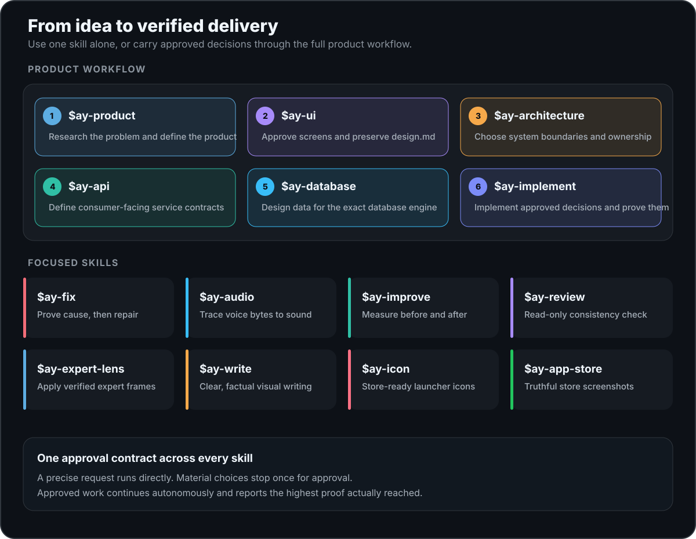

<div align="center">
  <h1>AY Skills</h1>
  <p><strong>Understand first. Interrupt less. Finish the job.</strong></p>
  <p>
    <a href="https://github.com/ALVIN-YANG/ay-skills/actions/workflows/test.yml"></a>
    <a href="https://github.com/ALVIN-YANG/ay-skills/releases"></a>
    <a href="LICENSE"></a>
  </p>
  <p><a href="README.zh-CN.md">简体中文</a></p>
</div>

AY Skills started with the things that kept bothering me when I worked with AI: product ideas became specs before anyone checked the user or market, work began before the request was understood, bugs were guessed at, refactors had no baseline, articles read like manuals, reviews changed the code, and store icons were guessed from the most literal object.

So I turned them into standalone skills. A clear request gets done. If a real product or technical choice is still open, the agent investigates, asks once, and continues inside the boundary you approved.

<p align="center">
  
</p>

## Skills

| Skill | Use it when | What it does |
|---|---|---|
| [`ay-product`](skills/ay-product/SKILL.md) | Turning a rough idea into a product direction, MVP, requirement, or PRD | Researches the problem and market, recommends a focused product, and makes assumptions testable |
| [`ay-work`](skills/ay-work/SKILL.md) | Building a feature or working through an unclear requirement | Clarifies the open choices, then builds and verifies the result |
| [`ay-fix`](skills/ay-fix/SKILL.md) | Debugging a bug, regression, crash, flaky test, or slowdown | Confirms the cause before making the smallest useful repair |
| [`ay-improve`](skills/ay-improve/SKILL.md) | Refactoring or improving performance and maintainability | Establishes a baseline, makes the change, and compares the result |
| [`ay-write`](skills/ay-write/SKILL.md) | Writing or substantially rewriting an article, tutorial, or visual explainer | Produces clear, natural long-form prose without filler |
| [`ay-review`](skills/ay-review/SKILL.md) | Reviewing a diff, branch, plan, or release | Stays read-only and reports consequential issues backed by evidence |
| [`ay-icon`](skills/ay-icon/SKILL.md) | Creating or replacing an App Store, Play Store, or launcher icon | Locks metaphor and style, then generates, inspects, and installs the mark |

Install one or all of them. They do not depend on a router or on each other, and a small change does not have to become a planning exercise.

## Install

Install all of them for Codex and Claude Code:

```bash
npx skills@latest add ALVIN-YANG/ay-skills -a codex claude-code -g -y
```

To choose individual skills or install them in the current project:

```bash
npx skills@latest add ALVIN-YANG/ay-skills
```

Claude Code also supports the native plugin:

```text
/plugin marketplace add ALVIN-YANG/ay-skills
/plugin install ay-skills@ay-skills
```

Describe the task in ordinary language. The matching skill should fire on its own. Naming `$ay-work` or another skill is optional, only when you want to force one.

```text
Research this idea and define a focused, testable MVP.
Add an export flow to this app.
Diagnose and fix this intermittent test.
Simplify this module from a measured baseline.
Turn these notes into a clear illustrated article.
Review this branch without changing files.
Redesign this app's store icon and install the asset set.
```

## A short example

```text
You: Add offline mode.

AY: The app currently assumes a live connection. I recommend read-only cached data
offline, a visible stale-data state, and queued writes as a non-goal for this change.
I will verify cold launch, reconnect, and stale-data behavior. Approve this boundary?

You: Approved.

AY: Implemented the approved flow and ran the focused tests. Queued writes remain out
of scope; real-device reconnect behavior is the only unverified surface.
```

## Use with other skills

AY Skills can sit beside specific artifact and tool skills such as frontend design, PDF, spreadsheet, or accessibility workflows. The specific skill should lead; AY supplies the approval and evidence boundary when useful.

Avoid installing two broad workflows for the same job and expecting reliable automatic routing. For example, choose one primary debugging or code-review workflow, install alternatives per project, or invoke the one you want explicitly.

## When it stops to ask

A precise request is already approval: investigate, make the change, and verify it.

The agent stops when it would otherwise have to decide product behavior, architecture, data contracts, dependencies, scope, risk, cost, rollback, or an external action for you. Once you approve the direction, it keeps going unless that boundary changes.

`ay-product` investigates discoverable product and market facts itself, asks only about decisions that materially change the direction, and stops before implementation.

Reviews are the exception: `ay-review` stays read-only unless you ask for fixes.

## Writing with visuals

`ay-write` works out the point, structure, and purpose of each visual before choosing a tool. Small precise diagrams use SVG; editable architecture uses draw.io or Excalidraw; quantitative claims use charts with traceable data; covers and scenes can use image generation.

It only asks when style or editability would change the result, or when a new tool, dependency, paid service, or project runtime is required.

## Small by design

Seven skills. No router, modes, hooks, telemetry, statusline, automatic commits, or mandatory planning files. Each skill has one job and can be installed on its own.

AY Skills follows the [Agent Skills specification](https://agentskills.io/specification). Portable installation is tested in Codex and Claude Code, and the Claude Code plugin is tested separately. The Codex manifest is validated for local marketplace testing and future directory submission; a public Codex plugin listing is not claimed. Other hosts are not claimed until they are verified.

<details>
<summary>Development and verification</summary>

```bash
python3 scripts/verify_skills.py
python3 -m unittest discover -s tests -v
python3 scripts/run_routing_evals.py --host codex
python3 scripts/run_routing_evals.py --host claude
python3 scripts/run_behavior_evals.py
python3 scripts/run_product_evals.py
python3 scripts/run_product_evals.py --research-mode live
```

Static checks run in CI. Routing evals cover all AY skills, no-skill requests, and coexistence with more specific skills. The black-box Codex suite runs real isolated tasks and verifies observable changes and approval boundaries. Product evals compare `ay-product` with an unskilled baseline against fixed cases and a shared rubric; current market research runs separately. Live model checks require the matching local CLI and account access; black-box execution currently covers Codex.

</details>

## Influences

AY Skills is original work informed by [mattpocock/skills](https://github.com/mattpocock/skills), [Superpowers](https://github.com/obra/superpowers), [Waza](https://github.com/tw93/Waza), [PM Skills](https://github.com/phuryn/pm-skills), [awesome-copilot](https://github.com/github/awesome-copilot), and [claude-skills](https://github.com/alirezarezvani/claude-skills): useful questioning, evidence-first product discovery, root-cause discipline, and small skills with clear boundaries. It does not copy their skill text or runtime code.

## License

[MIT](LICENSE) © 2026 Alvin Yang
