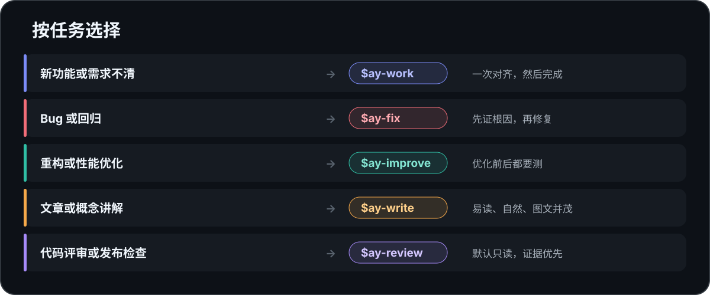

<div align="center">
  <h1>AY Skills</h1>
  <p><strong>让 AI 先弄清楚再动手，少打断，也别自作主张。</strong></p>
  <p>
    <a href="https://github.com/ALVIN-YANG/ay-skills/actions/workflows/test.yml"></a>
    <a href="https://github.com/ALVIN-YANG/ay-skills/releases"></a>
    <a href="LICENSE"></a>
  </p>
  <p><a href="README.md">English</a></p>
</div>

AY Skills 来自我每天和 AI 一起做事时反复遇到的烦心事：产品点子还没查用户和市场就写成了需求，多轮页面设计越画越不像一套，后端还没定边界和契约就开始写代码，Bug 靠猜，流式语音有杂音却不分层排查，重构没有基线，评审时顺手改代码，发布时又把本地、提交和线上状态混为一谈。

所以我把它们做成了可以单独安装的 Skill。任务说清楚了就直接做；还有产品或技术上的关键选择，就先调查、问一次，然后在你确认的范围内完成。

<p align="center">
  
</p>

## Skill

| Skill | 什么时候用 | 它会做什么 |
|---|---|---|
| [`ay-product`](skills/ay-product/SKILL.md) | 把一个简单设想变成产品方向、MVP、需求或 PRD | 调查用户问题和市场，给出聚焦的产品建议，并把假设变成可验证的问题 |
| [`ay-expert-lens`](skills/ay-expert-lens/SKILL.md) | 问“谁最懂这个”，或要求用真实专家的公开框架分析开放问题 | 选最匹配的可核验框架，应用判断规则，区分原始观点、推演和建议 |
| [`ay-ui`](skills/ay-ui/SKILL.md) | 确定视觉方向、逐页设计产品界面或整理 UI 交接 | 锁定一套视觉契约，用可见页面迭代，只记录确认过的设计 |
| [`ay-architecture`](skills/ay-architecture/SKILL.md) | 写代码前设计新系统或子系统 | 定义最简单可行的边界、数据归属、部署、故障隔离和演进方式 |
| [`ay-api`](skills/ay-api/SKILL.md) | 设计 REST、GraphQL、gRPC、服务、事件或 Webhook 契约 | 从调用方任务推导稳定接口，不把数据库表直接翻译成 CRUD |
| [`ay-database`](skills/ay-database/SKILL.md) | 选择数据库，或设计表、索引、事务和迁移 | 从业务约束与访问路径出发，再应用具体数据库引擎的规则 |
| [`ay-implement`](skills/ay-implement/SKILL.md) | 落地已经确认的功能、设计或普通代码变更 | 保留已确认决策，完成最小闭环，并验证真实结果 |
| [`ay-fix`](skills/ay-fix/SKILL.md) | 排查 Bug、回归、崩溃、偶发失败或异常变慢 | 先确认根因，再做最小有效修复 |
| [`ay-audio`](skills/ay-audio/SKILL.md) | 实现或排查 Apple 平台的流式 TTS 与语音播放 | 从服务端字节一路定位到混音和设备，并以真实听感验收 |
| [`ay-improve`](skills/ay-improve/SKILL.md) | 重构，或者优化性能和可维护性 | 先建立基线，修改后再比较结果 |
| [`ay-write`](skills/ay-write/SKILL.md) | 写文章、教程、长篇改稿或图文解释 | 写出自然、清楚、没有废话的长内容 |
| [`ay-review`](skills/ay-review/SKILL.md) | 评审代码、分支、方案或发布准备度 | 默认只读，只报告重要且有证据的问题 |
| [`ay-icon`](skills/ay-icon/SKILL.md) | 设计或替换 App Store、Play 商店或启动器图标 | 先锁定隐喻和风格，再生成、检查并装进资源 |
| [`ay-app-store`](skills/ay-app-store/SKILL.md) | 生成宣传图，或准备、提交、跟踪和修复 Apple App Store 发布 | 用当前构建的真实 UI 制作宣传图，再对齐代码、元数据、付费项目、账号和实时审核状态 |

可以只装一个，也可以全部安装。它们彼此不依赖，不需要路由器，也不会把一个小改动变成一场规划会议。

完整产品通常按 `ay-product → ay-ui → ay-architecture → ay-api → ay-database → ay-implement` 交接，需要时用 `ay-review` 检查文档一致性或实现结果。有了可发布构建后，`ay-app-store` 可以先用真实 UI 生成可复现的宣传图，再进入提交。这只是建议顺序，不是强制流水线。技术可行性会阻塞 UI 时，架构可以提前；每个 Skill 也都能从已有输入单独工作。

0.8.0 增加了 `ay-expert-lens`，用可核验的专家框架分析开放问题，不冒充本人，也不编造引语。共存路由、产物与运行验收、三条端到端旅程、独立安装和发布包仍是分开的证明层。

## 安装

建议先查看列表，再交互选择需要的 Skill：

```bash
npx skills@latest add ALVIN-YANG/ay-skills -l
npx skills@latest add ALVIN-YANG/ay-skills
```

常用组合可以一次安装。产品与设计组合：

```bash
npx skills@latest add ALVIN-YANG/ay-skills -s ay-product ay-ui ay-architecture ay-review -a codex claude-code -g -y
```

全栈交付组合：

```bash
npx skills@latest add ALVIN-YANG/ay-skills -s ay-product ay-ui ay-architecture ay-api ay-database ay-implement ay-review -a codex claude-code -g -y
```

确定需要全部十四个时：

```bash
npx skills@latest add ALVIN-YANG/ay-skills -s '*' -a codex claude-code -g -y
```

Claude Code 也可以用原生插件：

```text
/plugin marketplace add ALVIN-YANG/ay-skills
/plugin install ay-skills@ay-skills
```

查看、升级和移除全局 Skill：

```bash
npx skills@latest list -g
npx skills@latest update -g
npx skills@latest remove ay-audio -g
```

平时直接说要做什么，对应 Skill 会自己跟上。不必写 `$ay-implement`；只有想强制指定时才点名。

```text
给应用增加导出流程。
调查这个设想，并定义一个聚焦、可验证的 MVP。
找出最适合这个开放决策的真实专家框架，核验后应用到当前问题。
把确认过的产品逐页做成设计图，再整理 design.md。
写代码前先完成系统架构、接口和数据库设计。
诊断并修复这个偶发测试。
排查这个 macOS 流式 TTS 为什么噼啪响，并修复已确认的音频边界。
从真实基线出发简化这个模块。
把这些笔记写成清楚好读的图文文章。
评审这个分支，不要修改文件。
重做这个应用的上架图标并装进资源。
用当前发布构建生成一套可复现的 Mac App Store 宣传图。
检查这个 iOS App 的审核准备情况，并提交确认无误的版本。
```

## 一个实际例子

```text
你：增加离线模式。

AY：当前应用默认一直联网。我建议首版只支持离线查看缓存数据，明确显示
“数据可能过期”；离线写入和自动排队不在本次范围。验收覆盖冷启动、断网查看、
恢复联网三条路径。按这个边界做吗？

你：可以。

AY：已按确认范围完成并通过相关测试。离线写入仍未实现；真机恢复联网是目前
唯一没有验证的环节。
```

## 和其他 Skill 一起使用

AY Skills 可以和前端设计、PDF、表格、无障碍检查等专用 Skill 共存。任务命中专用 Skill 时，由专用 Skill 主导；需要时再沿用 AY 的批准和证据边界。

职责重叠时按交付物选主 Skill：

| 请求 | 同时安装时由谁主导 |
|---|---|
| 明确要求用真实专家框架分析开放决策 | `ay-expert-lens`；具体产物和执行仍由领域 Skill 负责 |
| 要求第一人称模拟专家或名人 | 专用人格或 Best Minds Skill；`ay-expert-lens` 不冒充本人 |
| 通用 App Store 准备、提交、拒审恢复 | 专用 App Store 发布 Skill；`ay-app-store` 主导真实 UI 宣传图 |
| Apple AppIcon、`.icns` 生成和安装 | 专用 Apple 图标资产 Skill；`ay-icon` 主导开放的隐喻与方向 |
| 纯中文长文、自然语言改稿 | 专用中文写作 Skill；`ay-write` 主导调研、英文或图解型文章 |
| 只问 Bug 为什么发生 | 专用诊断 Skill；需要完成修复时用 `ay-fix` |
| 选择或深化模块接口、代码边界 | 专用代码库设计 Skill；边界确认后再用 `ay-improve` 执行重构 |
| 明确从某个 commit/branch 做代码评审 | 专用代码评审 Skill；跨产品、设计、架构和实现用 `ay-review` |

仍有歧义时，只在本项目安装其中一套，或者明确写 `$skill-name`。

## 三条真实交接旅程

仓库用同一份产品材料连续验证，而不是让每个 Skill 各写一份互不相干的文档：

- FieldLog：产品定义、真实 SVG 页面、模块化单体、API、PostgreSQL、可运行实现和跨文档评审。
- PairDown：本地 macOS 产品、页面、架构、SQLite、禁止自动删除的实现与评审。
- NextStop：无账号公交产品、离线与权限状态、页面、架构、API、可运行实现与评审。

这些是合成测试案例，不冒充真实用户研究或线上产品成绩。定义见 [`tests/journey-scenarios.json`](tests/journey-scenarios.json)。

## 什么时候会停下来问你

任务足够明确，指令本身就是批准：调查、修改、验证，直接做完。

只有需要替你决定产品行为、架构、数据契约、依赖、范围、风险、费用、回滚方式或外部操作时，才会停下来问。方向确认后，只要边界没变，就继续做到验证完成。

`ay-product` 会自己调查能查到的产品和市场事实，只询问会实质改变方向的选择，并在 UI、架构和实现开始前停下。几个设计 Skill 也遵守同一条边界，只产出确认过的契约，代码由 `ay-implement` 负责。

评审是个例外：除非你明确要求修复，`ay-review` 始终只读。

## 写文章时怎么配图

`ay-write` 会先想清楚文章要讲什么、怎么组织、每张图解决什么问题，再选工具。小而精确的图解用 SVG，需要编辑的架构图用 draw.io 或 Excalidraw，数据结论用来源可追溯的图表，封面和场景才考虑生图。

只有风格或可编辑性会改变结果，或者需要安装新工具、依赖、付费服务和项目运行环境时，它才会问你。

## 保持小而清楚

十四个 Skill。没有路由器、模式标签、hooks、遥测、状态栏、自动提交或强制规划文件。每个 Skill 各做一件事，也能单独安装。

AY Skills 遵循 [Agent Skills 规范](https://agentskills.io/specification)。便携安装、Codex 与 Claude 的实时路由、Claude Code 原生插件、CI、发布包和远程安装是彼此独立的验证层；每次发布只声明实际检查过的层级。Codex 插件清单面向本地市场测试和以后提交公共目录，目前不声称已公开上架。

<details>
<summary>开发与验证</summary>

```bash
python3 scripts/verify_skills.py
python3 -m unittest discover -s tests -v
python3 scripts/verify_portable_install.py
python3 scripts/package_release.py --output /tmp/ay-skills.tar.gz
python3 scripts/package_release.py --verify /tmp/ay-skills.tar.gz
python3 scripts/run_routing_evals.py --host codex
python3 scripts/run_routing_evals.py --host codex --catalog global
python3 scripts/run_routing_evals.py --host codex --catalog ay-only
python3 scripts/run_routing_evals.py --host claude
python3 scripts/run_behavior_evals.py
python3 scripts/run_journey_evals.py
python3 scripts/run_product_evals.py
python3 scripts/run_product_evals.py --research-mode live
```

CI 运行结构、单元、独立安装和发布包检查。路由测试可以使用固定竞品目录、本机真实全局目录，或只安装 AY 来验证独立回退。Codex 行为测试默认同时安装 AY 与固定竞品 Skill，提示不点名 Skill，并检查文件、PNG、SVG、不可修改的测试、生成物可复现性和可执行结果。旅程测试在同一工作区连续交接，要求语义约束一致，并由最终复核明确证明阻断项为零。产品评测继续使用固定案例、holdout 和统一评分标准；实时市场调研单独运行。

需要模型账号的动态评测不放进普通 CI。PNG 测试夹具还需要 Pillow；本机没有时用 `uv run --with pillow` 临时运行，不把它加入项目依赖。结果写入本地 `eval-results/`；旅程失败会保留工作区与最终答复，修正评分器后可用 `--recheck-dir` 重验，不必再次调用模型。网络故障单独显示为 `INFRA`，不计作 Skill 失败。发布说明只记录该版本实际跑过的模型、CLI、目录和通过率。推送 `v<VERSION>` tag 后，发布工作流才会创建并重新下载 GitHub Release；源码版本、tag 和公开 Release 是不同状态。

</details>

## 灵感来源

AY Skills 是原创项目，参考了 [Superpowers](https://github.com/obra/superpowers)、[Anthropic Skills](https://github.com/anthropics/skills)、[wshobson/agents](https://github.com/wshobson/agents)、[PM Skills](https://github.com/phuryn/pm-skills)、[awesome-copilot](https://github.com/github/awesome-copilot)、[claude-skills](https://github.com/alirezarezvani/claude-skills)、[mattpocock/skills](https://github.com/mattpocock/skills) 和 [Waza](https://github.com/tw93/Waza)。借鉴的是实现前确认、UI 风格一致、架构/API/数据库分工、按数据库引擎设计、证据优先和小职责边界。

宣传图流程还参考了 [store-screenshot-mockups](https://github.com/iamngoni/store-screenshot-mockups)、[app-store-screenshots](https://github.com/ParthJadhav/app-store-screenshots) 和 [Shotsmith](https://github.com/gyugyu86/app-store-screenshot-studio)：保留真实上架 UI，让整套图可以复现，按准确尺寸渲染，并检查最终导出文件。项目没有复制它们的 Skill 文本或运行时代码，也没有引入强制模式、强制文档、自动提交和默认架构套路。

`ay-expert-lens` 中“按问题选专家”的启发来自 MIT 许可的 [Best Minds](https://github.com/Agentchengfeng/best-minds)。AY 重新设计了更窄的原创流程：应用可核验的公开框架，区分来源与推演，不冒充本人，也不编造对方“会怎么说”。

## 许可证

[MIT](LICENSE) © 2026 Alvin Yang
